# Fluxos de Módulos por Perfil de Acesso — StrivePersonal

**Gerado em:** 2026-07-07
**Fonte:** leitura direta do código (`src/lib/permissions.ts`, `src/lib/modules-config.ts`, `src/lib/supabase/module-access.ts`, `src/lib/supabase/context.ts`, actions e migrations) + grafo semântico (`graphify-out/`) + agentes de exploração dedicados por área.

Este documento descreve, para cada módulo do sistema, o fluxo passo a passo desde a entrada do usuário até a conclusão da ação, e como esse fluxo muda conforme o perfil de acesso:

- **Personal autônomo** — dono do próprio negócio (tenant `autonomo`)
- **Academia** — tenant `academia`, com papéis internos: `owner`, `admin`, `gerente`, `operador`, `personal` (staff)
- **Aluno** — usuário `student`
- **Admin Global** — `global_admin`, gerencia toda a plataforma (todos os tenants)

---

## 0. Modelo de papéis — a base de tudo

Antes de entrar em cada módulo, é essencial entender que existem **dois sistemas de papel sobrepostos**, e quase todo bug de permissão do projeto nasce de confundir os dois:

| Onde mora | Valores possíveis | Granularidade | Existe para |
|---|---|---|---|
| `profiles.role` (enum `app_role`) | `global_admin` \| `personal` \| `student` | Grosseiro — só serve para roteamento macro | Todo usuário do sistema, sempre |
| `tenant_members.role` (texto livre) | `owner` \| `admin` \| `gerente` \| `operador` \| `personal` | Fino — poder real dentro de uma academia | Só existe para tenants `academia` |

Em um tenant **autônomo**, não existe linha em `tenant_members` relevante — o personal É o dono, `profiles.role = 'personal'` já basta. Em uma **academia**, `profiles.role` continua `'personal'` para TODO mundo da equipe (owner, admin, gerente, operador, personal-staff) — quem diferencia é `tenant_members.role`.

`getCtx()` (`src/lib/supabase/context.ts`) resolve isso: retorna o **papel efetivo** — `profiles.role` para autônomo, `tenant_members.role` para academia. Toda a lógica de UI (menus, `module-access.ts`) e a maioria das server actions usam esse papel efetivo. A RLS no banco, por sua vez, usa as funções SQL `get_my_role()` (grosseiro) e `tenant_member_role(tenant_id)` (fino) — as duas convivem, cada policy usa a que precisa.

**Funções de permissão centrais** (`src/lib/permissions.ts`):
- `isManager(role)` → `owner` ou `admin`
- `isOperations(role)` → `gerente` ou `operador` (permissões **idênticas** entre os dois — só rótulos diferentes)
- `isBackofficeStaff(role)` → qualquer um dos 4 acima (todo staff institucional, não-personal)
- `canManageBilling(role, isAcademia)` → `!isAcademia || isBackofficeStaff(role)` (financeiro)

**Visibilidade de módulo por papel em academia** (`src/lib/modules-config.ts`) — três listas que governam o menu e o bloqueio de rota (`requireAcademiaModuleAccess`):

| Lista | Efeito |
|---|---|
| `ACADEMIA_HIDDEN_FROM_ADMIN_SLUGS` | owner/admin **não veem**: banco-de-exercícios, planos-de-treino, treinos-extras, execução-do-treino, avaliações-físicas, planos-alimentares, meu-progresso, assistente-ia (são módulos operacionais 1:1 personal↔aluno, não interessam à instituição) |
| `ACADEMIA_HIDDEN_FROM_PERSONAL_SLUGS` | personal-staff **não vê**: faturas, estoque (financeiro é da instituição, não do personal individual) |
| `ACADEMIA_OPERATIONS_VISIBLE_SLUGS` | gerente/operador **só veem** (allowlist): faturas, estoque, minha-agenda, anamnese — nada de treino/estratégia |

Tudo que não está em nenhuma lista (frequência, feedbacks, anamnese, arquivos, notificações, minha-agenda, desafios¹) fica visível para owner/admin/personal-staff normalmente, seguindo a regra padrão de `isBackofficeStaff` para o financeiro e RLS de tenant para o resto.

¹ *Desafios não está em nenhuma lista hoje — owner/admin veem o menu, mas o módulo é conceitualmente 1:1 personal↔aluno; vale revisitar se isso é intencional.*

---

## 1. Fluxo estrutural (a espinha dorsal)

### 1.1 Cadastro do personal autônomo (`signUpPersonal`)

```
/register → preenche nome, negócio (opcional), e-mail, senha
  → cria auth.users (role: personal)
  → cria tenants (tenant_type: autonomo, plan: free, max_students: 5)
  → profiles.tenant_id = novo tenant
  → tenant_members (role: owner, status: active) — best-effort
  → redireciona /dashboard
```
Ninguém aprova — é self-service. Nenhum admin global envolvido.

### 1.2 Criação de tenant pelo Admin Global

Existem **dois fluxos distintos** para os dois tipos de tenant — o admin global não usa o mesmo formulário:

**a) Cliente autônomo** (`/admin/clientes/novo` → `createClient_action`)
```
Admin preenche: negócio, e-mail, nome, plano, cor, logo
  → cria auth.users (personal) com senha provisória
  → busca max_students do plano escolhido
  → tenants (tenant_type: autonomo)
  → profiles.must_change_password = true
  → upload de logo (Storage: client-logos/{tenant_id}/)
  → e-mail de boas-vindas (edge function send-welcome-email)
  → admin_audit_logs (TENANT_CREATED)
```

**b) Academia** (`/admin/academias/nova` → `createAcademiaTenant`)
```
Admin preenche: nome academia, e-mail/nome do dono, contato, plano,
                max_students, max_personals, self_assign_enabled, CNPJ
  → cria auth.users (personal) — o dono
  → tenants (tenant_type: academia)
  → tenant_members (role: owner, status: active) ← diferença chave: já nasce com vínculo
  → habilita TODOS os system_modules em tenant_modules (inclusive academia-only como estoque)
  → e-mail de boas-vindas
  → admin_audit_logs (TENANT_CREATED)
```

Diferencial: academia nasce "pronta" (todos os módulos ligados, owner já vinculado via `tenant_members`); autônomo nasce enxuto (só o essencial do plano).

### 1.3 Login e roteamento (`signIn` + middleware)

```
/login → signInWithPassword
  → busca profiles.role
  → se global_admin: log em admin_audit_logs (ação LOGIN)
  → redireciona: global_admin→/admin | personal→/dashboard | student→/student
```

O middleware (`src/lib/supabase/middleware.ts`) intercepta toda rota (exceto `/api/*`, que cuida da própria autenticação) e força:
- `must_change_password = true` → único destino permitido é `/alterar-senha`, mesmo que o usuário tente ir a outra URL
- role incompatível com a área (ex.: `student` tentando abrir `/dashboard`) → redireciona para a área correta
- `global_admin` tem passe livre por qualquer rota protegida

### 1.4 Primeiro acesso — aluno ou membro de equipe com senha provisória

Esse fluxo se repete em 3 contextos (aluno cadastrado, membro de equipe convidado, cliente/academia criados pelo admin): sempre que uma conta nasce com `tempPassword`, `must_change_password` fica `true`.

```
1. Quem cria (personal/backoffice/admin) → gera tempPassword → envia e-mail
2. Usuário faz login com e-mail + senha provisória
3. Middleware detecta must_change_password=true → força /alterar-senha
4. Usuário define senha própria → flag limpa
5. Próximo login entra direto na área normal (/dashboard ou /student)
```

### 1.5 Equipe de academia (`/dashboard/equipe`)

Só existe (e só faz sentido) para `tenant_type = 'academia'` — em tenant autônomo a rota redireciona embora.

```
Owner/admin → "Convidar membro" → preenche e-mail, nome, papel (admin/gerente/operador/personal)
  → canCreateMemberRole(quem_convida, papel_alvo):
      owner/admin podem criar: admin, gerente, operador, personal
      gerente/operador só podem criar: personal (nunca outro staff)
  → verifica limite tenants.max_personals
  → e-mail já existe em OUTRO tenant? reaproveita o user_id (mesma pessoa, dois tenants)
  → e-mail novo? cria auth.users + senha provisória
  → tenant_members (role, status: invited/active)
  → e-mail de boas-vindas
```
Reenvio de senha e remoção (soft-delete via `status: 'removed'`) são exclusivos de owner/admin. Ao remover um personal, os alunos dele ficam com `assigned_personal_id = null` (na fila).

### 1.6 Cadastro e atribuição de alunos

```
createStudent():
  autônomo → o próprio personal sempre pode cadastrar
  academia → só backoffice (owner/admin/gerente/operador); personal-staff NÃO cadastra
  → valida limite tenants.max_students
  → e-mail já existe neste tenant (inativo)? reativa em vez de duplicar
  → e-mail existe em outro tenant? reaproveita conta
  → novo? cria auth.users + tempPassword
  → students (status: active)
  → atribuição inicial:
      autônomo → assigned_personal_id = o próprio owner
      academia → fica sem atribuição (fila), a menos que o formulário já indique um personal
  → e-mail de boas-vindas (se enviado)
```

Atribuição/reatribuição posterior em academia é feita pelo backoffice via `AssignPersonalSelect` na lista de alunos (`assigned_personal_id = tenant_members.id`) — personal-staff não pode fazer isso sozinho (RLS bloqueia). Se `tenants.self_assign_enabled = true`, o próprio personal pode pegar um aluno da fila de "sem atribuição".

A visibilidade de alunos segue a função SQL `can_view_student(tenant_id, assigned_personal_id)`: autônomo e owner/admin veem tudo; personal-staff só vê quem está atribuído a ele.

### 1.7 White-label / Branding (`/dashboard/ajustes`)

```
canManageAcademiaSettings(role) = isManager(role) → só personal autônomo (=owner) ou owner/admin de academia
  → upload de logo (Storage client-logos/{tenant_id}/)
  → valida cores hex
  → atualiza tenants: logo_url, primary_color, accent_text_color, on_primary_text_color
```
Gerente/operador/personal-staff não acessam. O resultado é consumido pelo lado do aluno (tema, logo no app) — branding nunca é por-personal, é por-tenant inteiro.

---

## 2. Módulos de Treino (personal ↔ aluno, 1:1)

Todos os módulos desta seção são **ocultos para owner/admin de academia** (`ACADEMIA_HIDDEN_FROM_ADMIN_SLUGS`) e para gerente/operador (fora do allowlist de operações) — só personal (autônomo ou staff de academia) e o próprio aluno interagem.

### 2.1 Banco de Exercícios

```
Personal → /dashboard/banco-de-exercicios/novo
  → nome, grupo muscular (+secundários), instruções, vídeo, tipo de carga, tipo de contagem
  → createExercise(): tenant_id, is_global=false
  → (upload opcional de vídeo → bucket exercise-videos)
```
Exercícios **globais** (`is_global=true`, disponíveis a todos os tenants) só são criados pelo `global_admin` em `/admin/banco-de-exercicios`. O personal enxerga: seus próprios + todos os globais.

### 2.2 Planos de Treino

```
Personal cria plano (nome, objetivo, datas) → status: inactive
  → adiciona rotinas (dias da semana, ex. "Segunda A")
  → em cada rotina, adiciona itens (exercício, séries, reps, carga, descanso, combos biset/triset/circuit)
  → publica → status: active
  → atribui a 1+ alunos → student_plan_assignments (status: active)
  → aluno vê em /student/treinos → plano aparece só se assignment ativo
  → aluno inicia rotina → cria workout_session (link para módulo Execução)
```

### 2.3 Treinos Extras

Igual a Planos de Treino, mas avulso (fora do plano semanal) e com um recurso a mais: **templates reutilizáveis**.
```
Personal cria como template (is_template=true, student_id=null) OU direto para um aluno
  → assignTemplateToStudent(): clona o template inteiro (workout + items) com student_id específico
  → aluno vê em /student/treinos-extras (visualização, sem edição)
```

### 2.4 Execução do Treino

```
Aluno abre uma rotina → "Iniciar Treino" → startWorkoutSession() (started_at, finished_at=null)
  → para cada exercício: registra séries/reps/carga usada (upsert em workout_session_exercises)
  → "Finalizar Treino" → finishWorkoutSession() (finished_at, duração, intensidade)
  → dispara gamificação em background (pontos: treino concluído, por exercício, 100% completo, aumento de carga)
  → Personal acompanha em /dashboard/execucao: histórico 90 dias de todos os alunos, progressão de carga por exercício
```
Esse evento (`finished_at` preenchido) é o gatilho principal que alimenta **Frequência** e **Ranking/Gamificação** (seção 3).

### 2.5 Avaliações Físicas

```
Personal, na ficha do aluno → "+ Nova Avaliação"
  → data, sexo, peso, altura, %gordura, medidas (braço/peito/cintura/quadril/coxa), notas
  → createAssessment(): calcula automaticamente BMI e TMB (Harris-Benedict)
  → histórico ordenado por data na mesma tela; sem cálculo automático de "evolução" (comparação é visual/manual)
```

### 2.6 Anamnese

Único módulo de treino com uma camada **institucional** visível a mais gente: aparece também no allowlist de gerente/operador (`ACADEMIA_OPERATIONS_VISIBLE_SLUGS`), porque operação precisa checar se o aluno preencheu a ficha de saúde antes de liberar atendimento.
```
Personal/admin configura campos customizados (além dos padrão globais) → anamnese_templates
Aluno preenche em /student/anamnese → saveAnamneseResponse() (upsert por user_id, não student_id — resposta acompanha a pessoa entre tenants)
  → ao completar pela 1ª vez (completed_at passa de null→valor, e quem salvou é o próprio aluno):
      trigger SQL dispara → insere trainer_notifications (type: anamnese_completed)
Personal/admin/operação acompanha em /dashboard/anamnese: estatísticas de quem completou/iniciou/não iniciou
```

### 2.7 Planos Alimentares

```
Personal cria plano (nome, objetivo, meta calórica) → status: inactive
  → adiciona refeições (café/almoço/lanche/janta) com horário sugerido
  → em cada refeição, busca alimento no banco (global + tenant) → define gramas
      → macros calculados em tempo real (calorias/proteína/carbo/gordura proporcional à porção)
  → edições ficam em rascunho local; "Salvar" na refeição persiste via replaceMealFoods (batch)
  → "Publicar Plano" → status: active
  → atribui a alunos (many-to-many) → student_meal_plan_assignments
  → aluno vê em /student/planos-alimentares (somente leitura, com macros do dia)
```

---

## 3. Módulos de Acompanhamento

### 3.1 Frequência

Sem tela própria de registro — é **inteiramente derivada** de `workout_sessions.finished_at`. Visível a personal e a owner/admin (não está em nenhuma lista de ocultação); gerente/operador não veem (fora do allowlist).
```
Aluno finaliza treino → agregado em /dashboard/frequencia:
  check-ins no mês, streak de dias consecutivos, alunos ativos na semana, últimas 10 sessões
```
Não há visão própria do aluno sobre sua frequência hoje.

### 3.2 Feedbacks

```
Personal → /dashboard/feedbacks → "Registrar Feedback"
  → seleciona aluno + plano de treino ativo, nota (1-5), comentário
  → addFeedback(): role personal, insere em workout_feedbacks
  → Dashboard: estatísticas (média, distribuição de notas, top alunos)
  → Aluno vê em /student/feedback: histórico do que o personal avaliou sobre os treinos dele
    (fluxo é personal→aluno; não há formulário do aluno enviar feedback de volta)
```
Owner/admin de academia veem esse módulo normalmente (não está em nenhuma lista de ocultação) — é acompanhamento institucional, junto com anamnese.

### 3.3 Meu Progresso

Oculto para owner/admin (`ACADEMIA_HIDDEN_FROM_ADMIN_SLUGS`) — é 1:1 personal↔aluno.
```
Aluno → /student/progresso → "Novo Registro": peso (opcional), notas, fotos
  → insere student_progress
Personal acompanha em dois níveis:
  /dashboard/progresso — visão agregada de todos os alunos (últimos 100 registros)
  /dashboard/alunos/[id]/progresso — detalhe por aluno, cruzando com workout_sessions
    (progressão de carga), monthly_points e student_badges (gamificação)
```

### 3.4 Arquivos

```
Personal/backoffice → /dashboard/arquivos → "Enviar Arquivo" (PDF/imagem, até 50MB)
  → gera signed upload URL → upload direto ao Storage (bypassa o servidor Next.js)
  → saveSharedFile(): metadados em shared_files, student_id específico OU null (compartilhado com todos)
  → Aluno vê arquivos onde student_id=null (públicos) ou = o próprio
```
Visível a owner/admin/personal — operador/gerente não veem (fora do allowlist).

### 3.5 Notificações (do personal)

Não tem tela de criação — é só **consumo**. Hoje o único gatilho automático é o de anamnese (seção 2.6): trigger SQL insere em `trainer_notifications`, entregue em tempo real via Realtime do Supabase. Owner/admin também recebem (não oculto); operador/gerente não.

### 3.6 Minha Agenda

Um dos poucos módulos visíveis **também para gerente/operador** (allowlist) — porque cobre datas de pagamento, além de atendimentos.
```
Personal/backoffice → /dashboard/agenda → calendário mensal
  → cria evento: presencial | virtual | pagamento a fazer | pagamento a receber
    (aluno vinculado é opcional, exceto quando o evento é uma solicitação do aluno)
  → Aluno vê /student/agenda: só os eventos onde está envolvido
  → Aluno pode SOLICITAR atendimento presencial (origin: student, status: pending_confirmation)
      → Personal confirma ou recusa (com motivo) → aluno vê o motivo e pode contatar via WhatsApp
```
*Nota: este módulo tem sobreposição conceitual com o novo módulo Financeiro/Cobranças (seção 4) no que toca "pagamento a fazer/receber" — são dois sistemas paralelos hoje (eventos soltos na agenda vs. cobrança recorrente com baixa/auditoria). Vale avaliar unificação futura.*

### 3.7 Ranking / Gamificação

Único módulo **cross-tenant por natureza** — o ranking de alunos é global na plataforma, mas a tela do personal/academia filtra a visão.
```
Global admin ativa o módulo (gamification_settings.is_active) e controla pontuação (pontos por treino
completo, por exercício, por aumento de carga, bônus de 100%)
Evento: aluno finaliza treino → monthly_points é incrementado, badges avaliadas
Fechamento mensal: Top 3 registrado, badges concedidas, novo ciclo começa do zero (só global_admin fecha)

Visão por perfil:
  Aluno (/student/ranking): ranking GLOBAL (todos os tenants), pódio, posição própria, badges, histórico de campeões
  Personal autônomo (/dashboard/ranking): ranking global + destaque dos seus próprios alunos nele
  Owner/admin academia (/dashboard/ranking): ranking INTERNO da academia + ranking agregado por personal
    (quem tem melhor desempenho na equipe), com filtro por personal
  Gerente/operador/personal-staff: sem acesso (fora de qualquer lista de visibilidade)
```

### 3.8 Desafios

Módulo Pro/Premium (bloqueado no plano Free). Oculto para gerente/operador (fora do allowlist); hoje **não** está na lista de ocultação de owner/admin — vale reconfirmar se é intencional, dado que é operacionalmente 1:1 personal↔aluno como os demais da seção 2.
```
Personal cria desafio (rascunho): nome, regras, premiações, duração, modo de liberação (tudo de uma vez | progressivo)
  → adiciona participantes (aluno existente ou convida novo) com medidas iniciais (peso, %gordura, medidas)
  → monta dias → em cada dia, itens (exercício, leitura, dica, arquivo)
  → "Iniciar desafio" → status: active
  → Aluno (/student/desafios): completa itens do dia (marca conclusão); exercício conta pontos de ranking
  → Personal "Finaliza": calcula ranking por queda de %gordura, grava result_rank/result_delta_pp
  → "Publica resultados": aluno passa a ver o ranking do desafio (com ou sem detalhes de medidas, à escolha do personal)
```

---

## 4. Financeiro (Cobrança de Alunos) — implementado nesta sessão

Único módulo com regra de acesso **assimétrica** dentro da academia: visível a owner/admin/gerente/operador, mas **nunca** a personal-staff (nem para os próprios alunos atribuídos a ele) — reflete a decisão de que finanças da academia não passam pelo personal individual.

```
canManageBilling(role, isAcademia) = !isAcademia || isBackofficeStaff(role)
  autônomo → sempre true (o personal é o dono do negócio)
  academia → só owner/admin/gerente/operador; personal-staff → false, sem exceção
```

### 4.1 Configurar mensalidade recorrente

```
Backoffice (ou personal autônomo) → /dashboard/financeiro → aba "Mensalidades" → "Nova mensalidade"
  → seleciona aluno, valor, dia de vencimento (1-28)
  → upsertStudentSubscription() → student_billing_subscriptions (active=true)
```

### 4.2 Geração automática das cobranças

```
Toda vez que /dashboard/financeiro é aberto (e, a partir de agora, também 1x/dia via Vercel Cron):
  generateMonthlyChargesFor(tenant): para cada assinatura ativa sem cobrança no mês corrente
      → cria financial_plans (status: pending, due_date = dia configurado)
  markOverdueChargesFor(tenant): pending com due_date < hoje → vira overdue
```

### 4.3 Baixa manual e auditoria

```
Backoffice → aba "Hoje"/"Todas" → "Dar baixa" → escolhe forma de pagamento (PIX/dinheiro/transferência/cartão/outro)
  → registerPayment(): status=paid, paid_at, paid_by=quem deu a baixa, payment_method
  → owner/admin veem, na coluna "Baixa", quem especificamente deu cada baixa (auditoria completa)
  → "Desfazer" reverte para pending/overdue (conforme a data), limpando paid_by/paid_at
```

### 4.4 Inadimplência

```
Aba "Inadimplentes": lista overdue + soma do valor em aberto (KPI "Em aberto")
```

### 4.5 Lembrete automático de vencimento (cron diário)

```
Vercel Cron (1x/dia, 8h BRT) → GET /api/cron/billing-reminders (autenticado via CRON_SECRET)
  → para cada tenant ativo: gera cobranças do mês, marca atrasados
  → busca cobranças pending com due_date=hoje e reminder_sent_at=null
  → pickReminderChannel(aluno): e-mail se tiver e-mail cadastrado; caso contrário, WhatsApp (canal
    reservado no enum, envio ainda não implementado — falta escolher provedor)
  → envia e-mail via edge function send-payment-reminder (Resend)
  → grava reminder_sent_at + reminder_channel (idempotente — nunca reenvia a mesma cobrança)
```

---

## 5. Assistente IA (Max Strive)

```
requireAcademiaModuleAccess('assistente-ia') — oculto para owner/admin de academia (é 1:1 personal↔aluno)
Personal abre ficha do aluno → aba "Assistente IA" → chat (componente MaxPanel)
  → edge function ai-assistant processa o prompt (integração com Claude API)
  → conversas em ai_conversations (RLS: só quem pode ver o aluno vê a conversa)
  → uso registrado em ai_usage_events (para rate-limit/billing da plataforma)
```
Módulo controlado por `system_modules`/`tenant_modules` — precisa estar habilitado para o tenant (ativação feita pelo admin global).

## 6. Estoque

```
Exclusivo de tenants academia (RLS bloqueia autônomo independentemente do papel)
Visível a owner/admin/personal-staff/gerente/operador — único módulo de treino-adjacente sem
distinção de papel dentro da academia (todo mundo da equipe pode mexer)
Backoffice/personal → /dashboard/estoque → cria item (nome, SKU, categoria, unidade, mínimo, custo, preço)
  → registra movimento (entrada/saída/ajuste) via RPC register_inventory_movement
    (transação atômica: atualiza quantity_on_hand + grava log imutável em inventory_movements)
  → alerta visual quando quantity_on_hand <= min_quantity
```
Sem fluxo de aluno.

---

## 7. Admin Global — visão consolidada

O `global_admin` é o único papel que atravessa todos os tenants. Área `/admin`:

| Página | Função |
|---|---|
| `/admin/clientes` | Gerencia tenants **autônomos** — criar, suspender, ativar, reenviar acesso |
| `/admin/academias` | Gerencia tenants **academia** — criar, editar limites, ver detalhe |
| `/admin/usuarios` | Todos os `profiles` da plataforma — busca, troca de role, reset de senha |
| `/admin/ranking` | Fecha o ciclo mensal do ranking global, vê histórico de campeões |
| `/admin/modulos` | Catálogo de `system_modules` — cria módulo novo, ativa/desativa globalmente |
| `/admin/banco-de-exercicios` | Exercícios globais (`is_global=true`), disponíveis a todos os tenants |
| `/admin/ia` | Uso da IA (Max) — eventos, custo, rate-limit |
| `/admin/logs` | `admin_audit_logs` completo — toda ação sensível fica registrada (login, criação/suspensão de tenant, troca de role, reset de senha, config de sistema) |

Toda ação relevante do admin global grava em `admin_audit_logs` (quem, o quê, quando, IP, metadata) — é a única camada com auditoria tão granular; dentro do tenant, a auditoria equivalente é o par `paid_by`/`created_by` específico de cada módulo (financeiro, estoque), não um log central.

---

## 8. Tabela-resumo de visibilidade por módulo × papel

| Módulo | Autônomo | Owner/Admin | Gerente/Operador | Personal (staff) | Aluno |
|---|:-:|:-:|:-:|:-:|:-:|
| Banco de Exercícios | ✓ | ✗ | ✗ | ✓ | ✗ |
| Planos de Treino | ✓ | ✗ | ✗ | ✓ | ✓ (consome) |
| Treinos Extras | ✓ | ✗ | ✗ | ✓ | ✓ (consome) |
| Execução do Treino | ✓ (acompanha) | ✗ | ✗ | ✓ (acompanha) | ✓ (executa) |
| Avaliações Físicas | ✓ | ✗ | ✗ | ✓ | ✗ (dado do personal) |
| Anamnese | ✓ | ✓ | ✓ | ✓ | ✓ (preenche) |
| Planos Alimentares | ✓ | ✗ | ✗ | ✓ | ✓ (consome) |
| Frequência | ✓ | ✓ | ✗ | ✓ | ✗ |
| Feedbacks | ✓ | ✓ | ✗ | ✓ | ✓ (recebe) |
| Meu Progresso | ✓ (acompanha) | ✗ | ✗ | ✓ (acompanha) | ✓ (registra) |
| Arquivos | ✓ | ✓ | ✗ | ✓ | ✓ (recebe) |
| Notificações | ✓ | ✓ | ✗ | ✓ | — |
| Minha Agenda | ✓ | ✓ | ✓ | ✓ | ✓ (solicita) |
| Ranking | ✓ (global) | ✓ (interno academia) | ✗ | ✗ | ✓ (global) |
| Desafios | ✓ | ✓* | ✗ | ✓ | ✓ (participa) |
| **Financeiro (cobranças)** | ✓ | ✓ | ✓ | ✗ | — (visão futura) |
| Estoque | ✗ (n/a) | ✓ | ✓ | ✓ | — |
| Assistente IA | ✓ | ✗ | ✗ | ✓ | — |
| Equipe | ✗ (n/a) | ✓ | ✗ (só cadastra personal) | ✗ | — |
| Ajustes / White-label | ✓ | ✓ | ✗ | ✗ | — |

`*` não está formalmente na lista de ocultação de admin — comportamento atual, não necessariamente decisão intencional (ver seção 3.8).

---

## 9. Pontos de atenção identificados durante o levantamento

1. **Desafios não está em `ACADEMIA_HIDDEN_FROM_ADMIN_SLUGS`**, apesar de ser conceitualmente 1:1 personal↔aluno como os demais módulos de treino — possível inconsistência a confirmar.
2. **Minha Agenda ("pagamento a fazer/receber") e o novo módulo Financeiro** são dois sistemas paralelos de controle de dinheiro hoje — a agenda registra eventos soltos, o financeiro tem recorrência, baixa auditada e inadimplência. Vale decidir se a agenda deve passar a só mostrar (read-only) o que o financeiro gera, para não duplicar fonte de verdade.
3. **Frequência não tem contrapartida no lado do aluno** — ele não vê seu próprio histórico de assiduidade hoje.
4. **Lembrete de pagamento por WhatsApp** está reservado no schema (`reminder_channel`) mas sem provedor escolhido — implementação real pendente.

---

## Anexo — Fluxogramas (linguagem de produto)

Equivalente em Mermaid dos diagramas mostrados na conversa — mesma numeração das seções acima, sem nomes de função/tabela, pensado para leitura por quem não é técnico. Renderiza nativamente em GitHub, VS Code (extensão Markdown Preview Mermaid) e Notion.

### 0. Quem pode fazer o quê

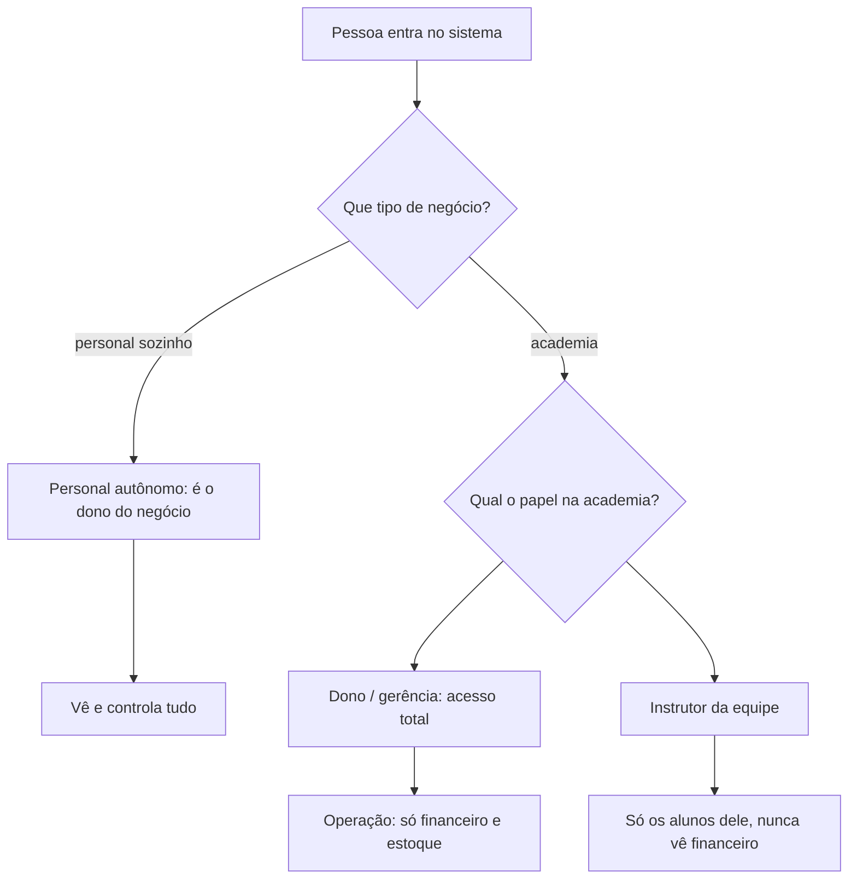

### 1.1 Como cada pessoa entra pela primeira vez

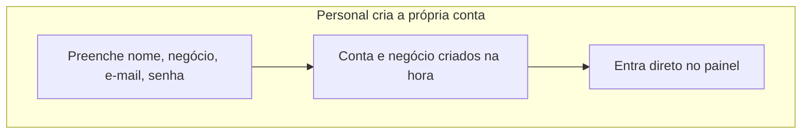

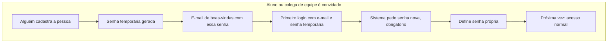

### 1.2 Como o time Strive cria uma conta nova

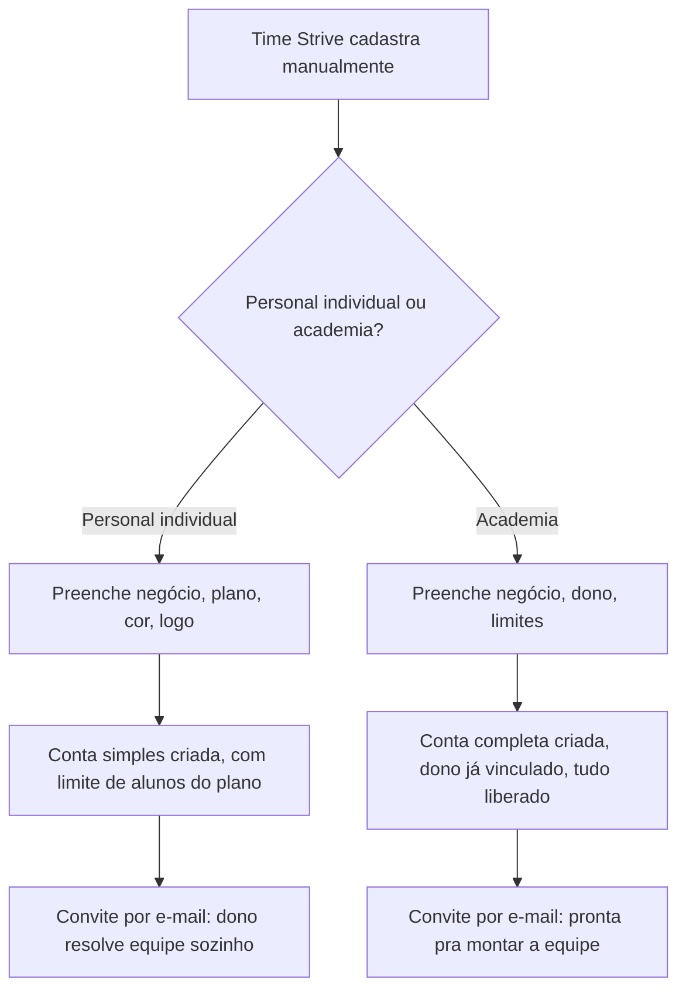

### 1.3 Como a academia monta o time

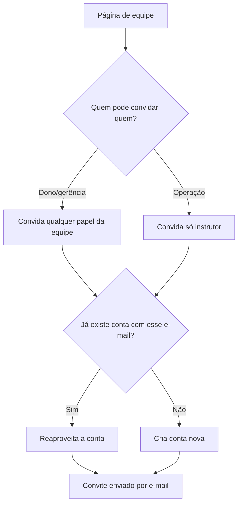

### 1.4 Como um aluno entra e ganha um instrutor

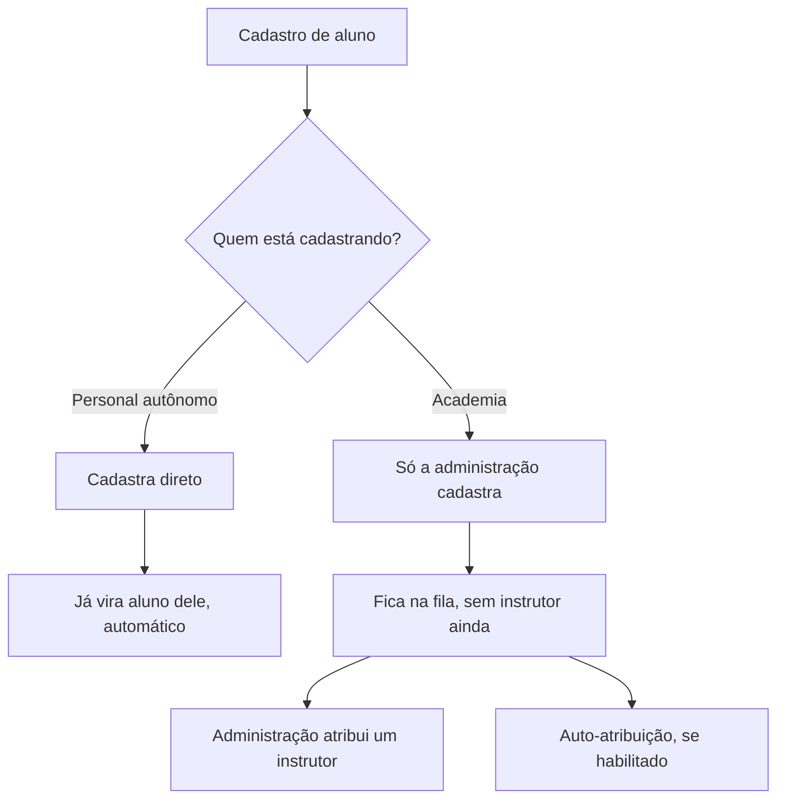

### 1.5 Personalizar a marca que o aluno vê

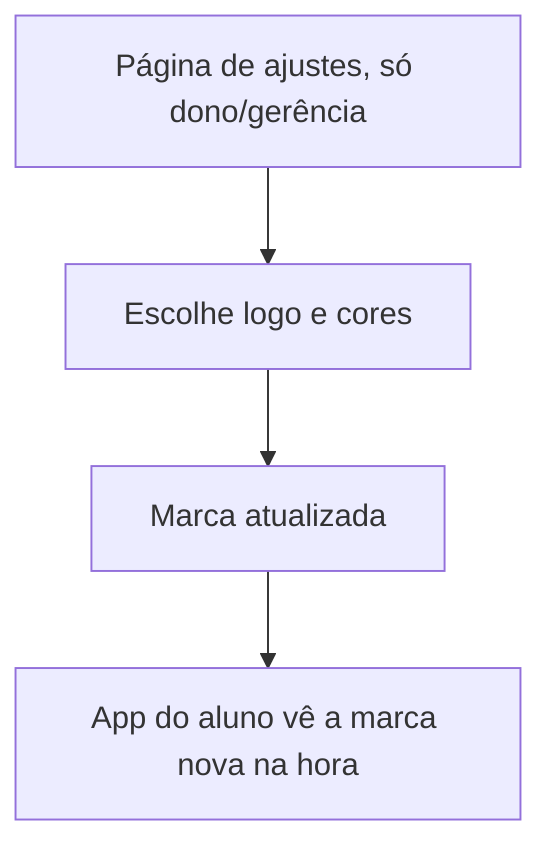

### 2.1 Banco de exercícios

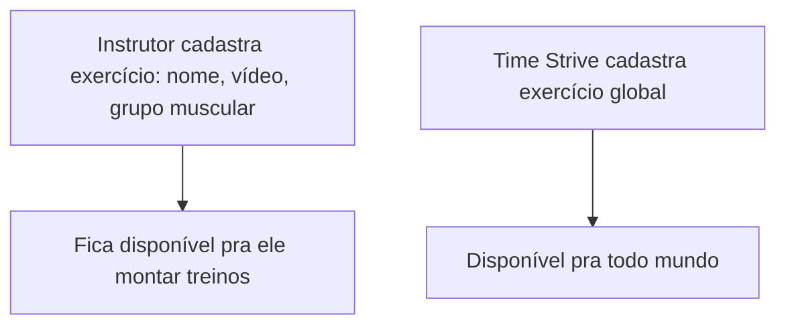

### 2.2 Planos de treino

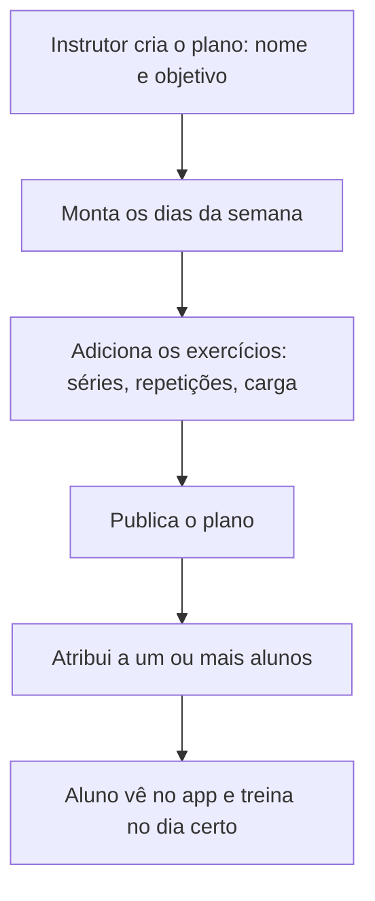

### 2.3 Treinos extras

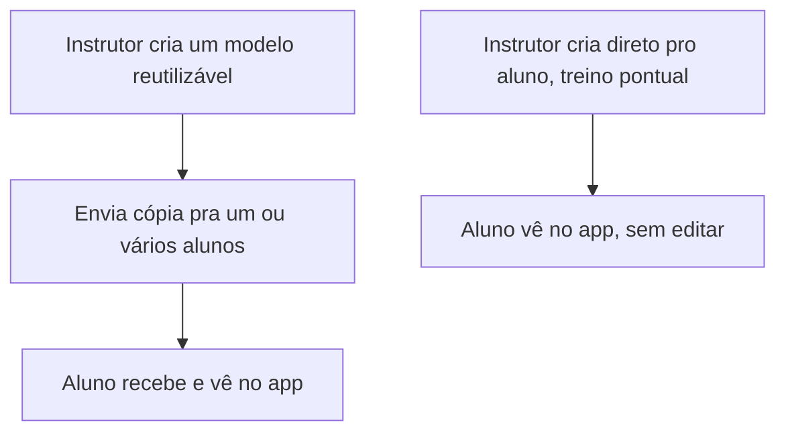

### 2.4 Execução do treino

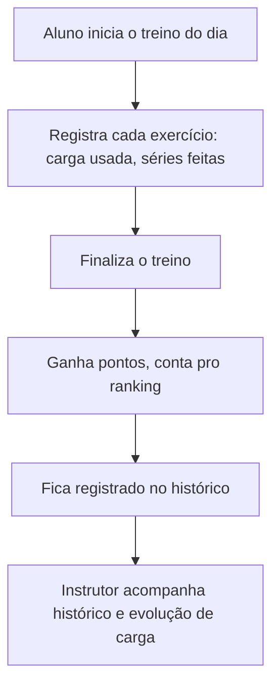

### 2.5 Avaliações físicas

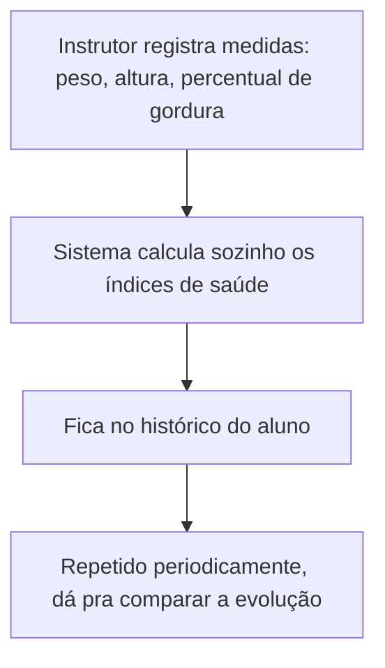

### 2.6 Anamnese

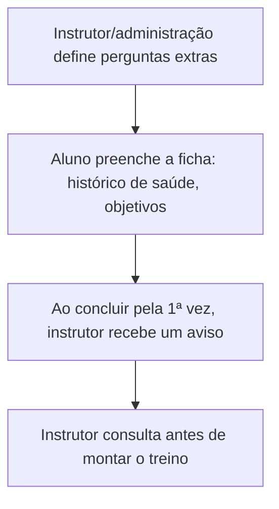

### 2.7 Planos alimentares

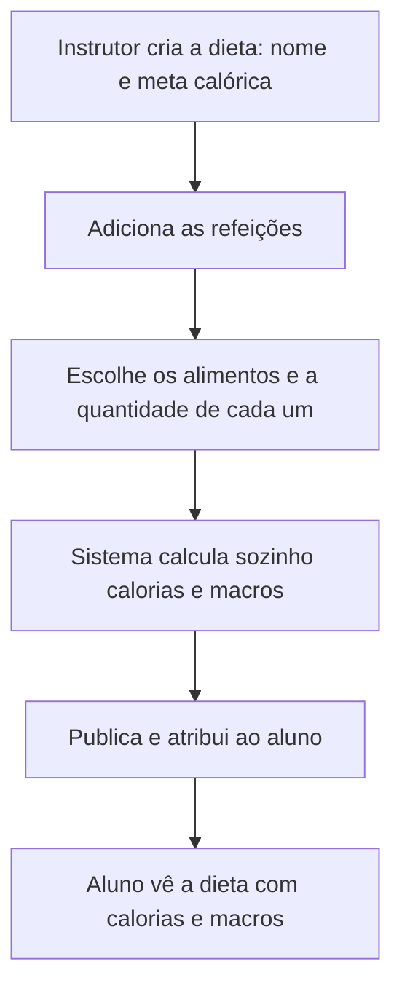

### 3.1 Frequência

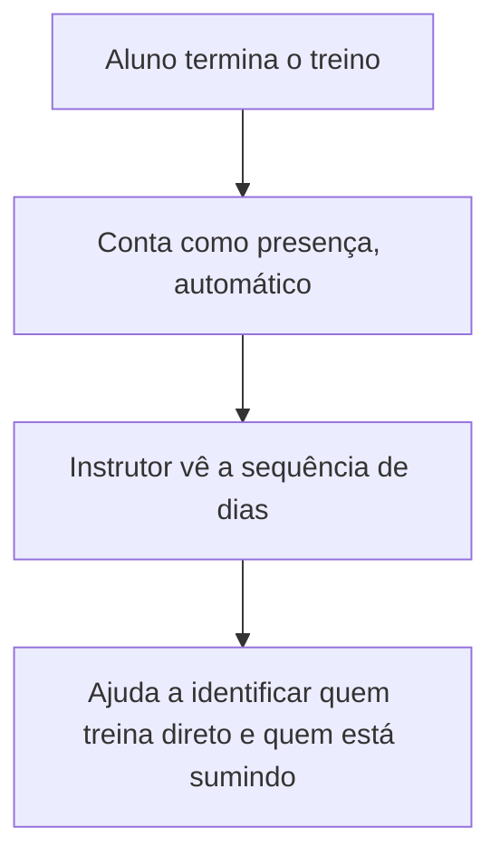

### 3.2 Feedbacks

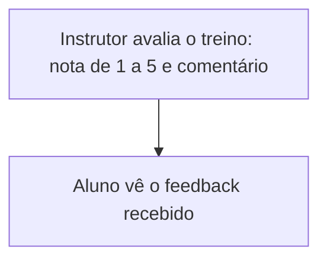

### 3.3 Meu progresso

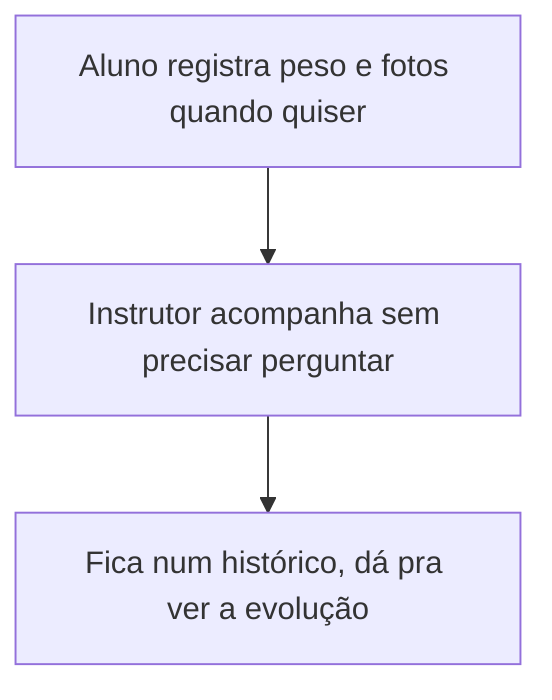

### 3.4 Arquivos

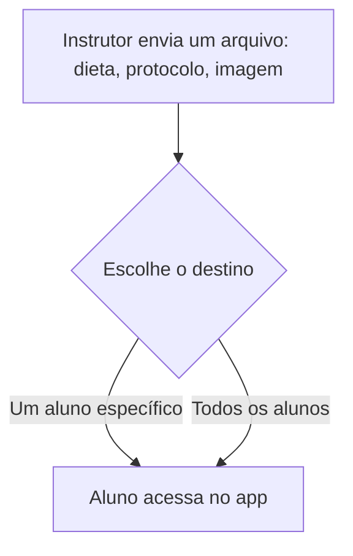

### 3.5 Notificações

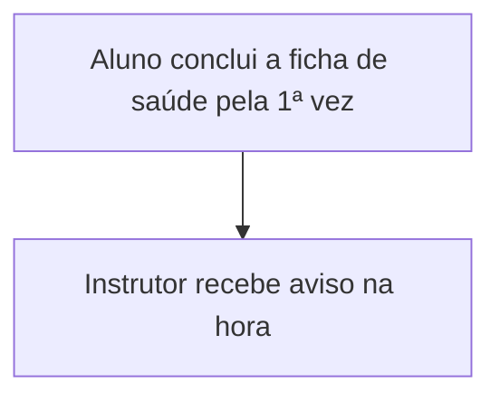

### 3.6 Minha agenda

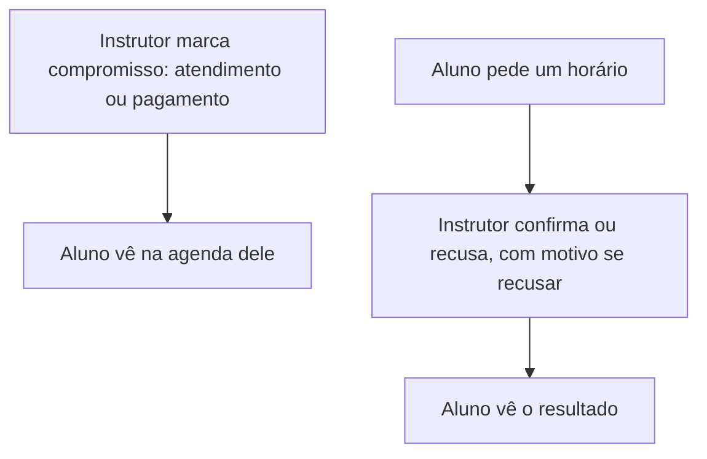

### 3.7 Ranking

```mermaid
flowchart TD
    A[Aluno treina] --> B[Ganha pontos]
    B --> C[Sobe no ranking]
    C --> D[Fim do mês: tem vencedor]
    D --> E[Placar recomeça do zero]
```

### 3.8 Desafios

```mermaid
flowchart TD
    A[Instrutor cria o desafio: duração, regras, prêmio] --> B[Convida os alunos]
    B --> C[Aluno cumpre atividades dia a dia]
    C --> D[Instrutor fecha o resultado]
    D --> E[Aluno vê sua colocação final]
```

### 4. Financeiro — cobrança de alunos

```mermaid
flowchart TD
    A[Administração configura valor e dia de vencimento] --> B[Todo mês a cobrança nasce sozinha]
    B --> C[No dia do vencimento, aluno recebe lembrete por e-mail]
    C --> D[Administração confere quem pagou]
    D -->|Pagou| E[Confirma o recebimento manualmente]
    D -->|Não pagou| F[Entra na lista de inadimplentes]
```

### 5. Assistente de IA (Max Strive)

```mermaid
flowchart TD
    A[Instrutor abre o chat na ficha do aluno] --> B[Pergunta o que precisar]
    B --> C[Max responde ou sugere treino]
```

### 6. Estoque

```mermaid
flowchart TD
    A[Equipe cadastra item: nome, quantidade mínima] --> B[Registra entrada ou saída]
    B --> C[Sistema atualiza a quantidade]
    C --> D[Avisa quando está acabando]
```

### 7. Admin global — visão geral

```mermaid
flowchart TD
    A[Time Strive vê a plataforma inteira] --> B[Cria contas: personal e academia]
    A --> C[Mantém o catálogo global de exercícios]
    A --> D[Fecha o ranking todo mês]
    A --> E[Audita tudo o que acontece]
```
